# Talent Land Mexico 2026 - Genius Arena - Salud Digna Atención 360° en Tiempo Real - Talent Hackathon 2026

---

## Detalles del Track

---

### 🎯 Introducción

Salud Digna es una red nacional de diagnóstico y atención preventiva que ha crecido rápidamente, su escala la posiciona como actor clave para estandarizar flujos operativos, datos clínicos y la experiencia del paciente a nivel nacional.

Hoy la atención está fragmentada. Comunicaciones internas lentas, sistemas aislados, recepción saturada, esperas inciertas y nulos mecanismos predictivos que den visibilidad al paciente sobre su trayecto y tiempos. Eso genera in-eficiencia operativa, pérdida de capacidad instalada y una percepción negativa del servicio pese a la cobertura amplia.

La solución esperada es un copiloto en tiempo real integrado al ecosistema (recepción, áreas clínicas y agendamiento) que entregue tracking transparente al paciente, predicción dinámica de tiempos, notificaciones ante cambios, gestión inteligente de capacidad y aprovechamiento de tiempos muertos para educación o preparación. Debe ser interoperable, de fácil adopción y demostrar KPIs claros (reducción de espera, aumento de throughput y mejora en satisfacción).

---

### 🩺 Problemática que Resuelve

La experiencia del paciente en clínica actualmente está **fragmentada** y llena de "puntos ciegos":

- Falta de comunicación en tiempo real entre áreas
- Tiempos de espera improductivos e inciertos
- Carga operativa excesiva en recepción
- Sistemas reactivos y aislados que impiden gestión inteligente de la capacidad
- El paciente no sabe qué estudios siguen, cuánto esperará, ni si hay retrasos

> **Analogía clave:** Así como la app de Uber te muestra en todo momento el estado de tu viaje (conductor, ruta, tiempos estimados), se busca replicar esa **visibilidad y transparencia** en la experiencia de atención médica de Salud Digna.

---

### 🎯 Objetivo Planteado

Desarrollar una solución basada en Inteligencia Artificial o modelos predictivos y de toma de decisiones en base a datos que orqueste el ecosistema de atención al paciente de extremo a extremo (end-to-end). El sistema debe actuar como un copiloto en tiempo real que optimice la toma de decisiones operativa y mejore la percepción del usuario mediante la hiperpersonalización y la transparencia total de su trayecto (tracking) en la clínica.

---

### 🔧 Tipo de Solución Esperada

Se espera la entrega de un prototipo funcional a nivel de prueba de concepto, con funcionalidades ilustrativas que demuestren su viabilidad y facilidad de adopción tanto para pacientes como para personal operativo de las clínicas.

---

### 💡 Funcionalidades Esperadas de la Solución

Para este Track, el entregable será un Prototipo funcional, donde se busca que los participantes puedan hacer uso de él.

1. **Guía en tiempo real al paciente** sobre tiempos de espera, siguiente estudio y preparación necesaria
2. **Notificaciones** ante retrasos o cambios en la atención
3. **Gestión inteligente de la capacidad instalada** para evitar saturación de servicios
4. **Aprovechamiento de tiempos muertos** transformando la espera en experiencia de salud proactiva
5. **Visibilidad total del trayecto** del paciente dentro de la clínica

---

### 📋 Fases del Track

| Fase | Entregable |
|---|---|
| **Fase 1** | Explicación justificada de la idea-solución (texto en plataforma de evaluación) |
| **Fase 2** | Evidencias del prototipo en alto porcentaje de avance |
| **Fase 3 — FINAL** | Demo en vivo + pruebas funcionales ante el jurado |

---

### 📋 Criterios 

- Capacidad tecnológica
- Creatividad-Innovación
- Originalidad – Alto impacto
- Alcance de Implementación
- Funcionalidad – Prototipo
- Facilidad y adopción de uso

---

### 🏆 Premio
| Concepto | Monto |
|---|---|
| Premio principal | $100,000 MXN |
| Incentivo extra (Salud Digna A.C.) | $50,000 MXN |
| **Total** | **$150,000 MXN** |

---

## Detalles de la Propuesta

---

### 🎯 Introducción de la Propuesta

Así como Uber no solo te muestra dónde está el conductor sino que optimiza la ruta en tiempo real. Nosotros no solo le mostramos al paciente en qué etapa está, la IA reordena su trayecto si detecta saturación.

Se propone una Solución Vanguardista, Versátil, Eficiente, y Confiable. Una equilibrio entre Tecnologia Vanguardista Vs Tecnología Consolidada, Explicable, Eficiente, y confiable. 

Al estar echo en docker-compose es reproducible y se puede desplegar tanto en Cloud como en On-Premise permitiendo asi el procesamiento local de información y obteniendo gobernanza de datos.

---

## 📋Metodología de Desarrollo 

- CRISP-DM
- SCRUM

--- 

## 🎯Arquitecturas 

- Micro servicios
- MultiAgent System
- RAG System

--- 

## 📋Tecnologías

### 📋Containers Ops

        Prometheus
        Grafana
        CAdvisor
        Loki

### 📋Containers y Tecnologías Planteadas

        AI: LLMs, TTS, VLMs, Text-to-Image.
        DB: Qdrant, Neo4J, MongoDB, PostgreSQL, Redis       
        AI Agent Orchestration: N8N / LangChain / LangGraph / LangSmith     
        Data Science: Random Forest, Isolation Forest, XGBoost, LightGBM
        Data Analysis: PowerBI, Plotly, Charts,js

###  📋Containers GUIs

        Open Web UI
        Web Server

---

## 📋 Interfaces UI/UX 

- Custome Web Experience
- WhatsApp/Telegram
- Open WebUI

---

## Detalles de la Solución

---

### 🎯 Introducción de la Solución

La solución actúa en tres frentes simultáneos. Le entrega al paciente transparencia y comunicación proactiva durante toda su visita. Le entrega al personal operativo una herramienta de toma de decisiones que anticipa problemas antes de que ocurran. Y le entrega a la dirección indicadores en vivo para medir el desempeño real de cada clínica.

Lo que distingue a PULSO de un sistema de turnos convencional es su capacidad de reacción autónoma. Cuando detecta saturación en un módulo, no solo alerta propone una solución y la ejecuta con aprobación de un clic. Cuando predice que un paciente no se presentará, activa la lista de espera antes de que el tiempo muerto ocurra. Cuando un paciente espera, convierte esa espera en una experiencia de salud personalizada.

Todo esto opera sobre infraestructura desplegable tanto en la nube como en sitio, garantizando que Salud Digna mantenga gobernanza total sobre los datos clínicos de sus pacientes.

---

## 📋Tipos de Usuarios Estimados

- Usuario - (Persona de cualquier edad que acude a realizarse estudios. Puede tener poca experiencia tecnológica.)

- Recepcionista (Personal de primera línea. Maneja alto volumen de pacientes, registros y orientación. Necesita respuestas rápidas y sin ambigüedades.)

- Secretarias (Gestiona agendas, expedientes, citas y comunicación entre áreas. Necesita automatización de tareas administrativas repetitivas.)

- Doctores Generales (Gestiona agendas, expedientes, citas y comunicación entre áreas. Necesita automatización de tareas administrativas repetitivas.)

- Doctores Especialistas (Requiere profundidad clínica, referencias cruzadas de estudios, y capacidad de análisis de imágenes médicas (VLM).)

- Administrador del Sistema (Supervisa el funcionamiento global, acceso de usuarios, rendimiento del sistema y toma decisiones estratégicas basadas en datos.)

---

## 🎯Medios de Interacción e Interfaces GUIs

Todos los usuarios pueden interactuar con las plataformas de comunicación (Chat WhatsApp/Telegram, Via Web (Open Web UI), y experiencia Interactiva (WebServer) ) 

Estos medios permiten la comunicación con el sistema central el cual puede optimizar, priorizar las citas, diagnósticos preliminares, informes, etc.

Las interacciones y capacidades de los agentes de IA mediante las interacciones los medios mencionados, dependería del perfil y los privilegios del usuario

---

### 🎯 Diagrama

---
